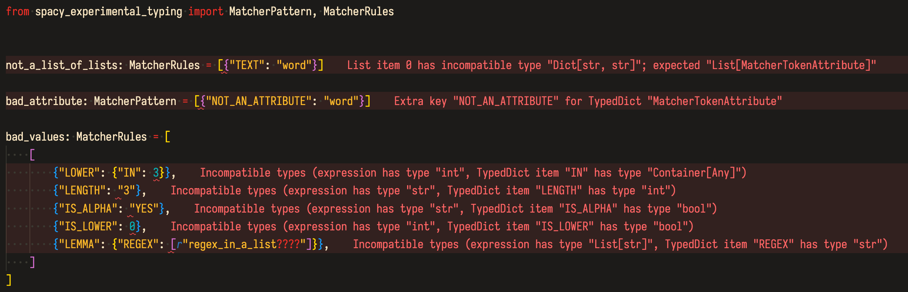

# spaCy Experimental Typing

Currently contains an implementation of [Matcher patterns](https://spacy.io/api/matcher#patterns) as a `TypedDict`, so your IDE or mypy can warn you if you create invalid match rules.

**Install**: 

```
pip intall git+https://github.com/pmbaumgartner/spacy-experimental-typing
```

**Types**:

- `MatcherTokenAttribute`: A `Dict` of a single token pattern match rule.
- `MatcherPattern`: A `List` of `MatcherTokenAttribute`s.
- `MatcherRules`: A `List` of `MatcherPattern`s.

**Example**

Works great with [VSCode Error Lens](https://marketplace.visualstudio.com/items?itemName=usernamehw.errorlens) extension.




Example file:

```python
from spacy_experimental_typing import MatcherPattern, MatcherRules


not_a_list_of_lists: MatcherRules = [{"TEXT": "word"}]

bad_attribute: MatcherPattern = [{"NOT_AN_ATTRIBUTE": "word"}]

bad_values: MatcherRules = [
    [
        {"LOWER": {"IN": 3}},
        {"LENGTH": "3"},
        {"IS_ALPHA": "YES"},
        {"IS_LOWER": 0},
        {"LEMMA": {"REGEX": [r"regex_in_a_list????"]}},
    ]
]
```

Mypy output:
```
tests.py:4: error: List item 0 has incompatible type "Dict[str, str]"; expected "List[MatcherTokenAttribute]"
tests.py:6: error: Extra key "NOT_AN_ATTRIBUTE" for TypedDict "MatcherTokenAttribute"
tests.py:10: error: Incompatible types (expression has type "int", TypedDict item "IN" has type "Container[Any]")
tests.py:11: error: Incompatible types (expression has type "str", TypedDict item "LENGTH" has type "int")
tests.py:12: error: Incompatible types (expression has type "str", TypedDict item "IS_ALPHA" has type "bool")
tests.py:13: error: Incompatible types (expression has type "int", TypedDict item "IS_LOWER" has type "bool")
tests.py:14: error: Incompatible types (expression has type "List[str]", TypedDict item "REGEX" has type "str")
Found 7 errors in 1 file (checked 1 source file)
```
